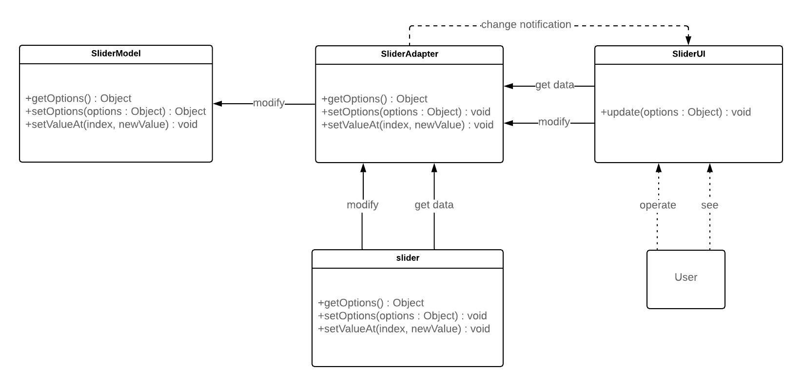

<!-- omit in toc -->
# range-slider-component

<!-- omit in toc -->
## Introduction
Realization of the range-slider component, that's used to allow a user to choose a value or range of values in the given interval, providing a user-friendly interface for that.

[Demo page](https://alanreidt.github.io/range-slider-component/)

The project had a lot of challenges along the way, as a result:
- I've learned quite a bit about MVC architecture and application design principles in general — now all of that gives me understanding of what can cause troubles later on, when I build something;
- It's taught me about the importance of automated unit tests, which has helped me to detect bugs during the refactoring and addition of new features phases;
- It's showed me the advantages of TDD approach and has helped to get used to the thinking in that way;
- I've practiced Javascript far and wide;
- And, of course, many more;

Initially was realized as a part of the [Full-stack development education system](https://www.fullstack-development.com/en#system).

<!-- omit in toc -->
### Requirements:
- [requirements in Russian](https://rizzoma.com/topic/d5c429337bcaa70548fb5aeedee6d92b/0_b_8ndo_78h7o/),
- [requirements in English](./_miscellaneous/requirements.md).

<!-- omit in toc -->
### Aimed skills:
- Object-oriented programming principles,
- MVC architecture,
- Application design principles,
- Functional programming approach,
- Documentation,
- Component API creation,
- TDD approach,
- UML diagram,
- Airbnb style guide.

<!-- omit in toc -->
## Table of Contents
- [Possible improvements](#possible-improvements)
  - [Tests](#tests)
- [Non-standard dependencies](#non-standard-dependencies)
- [Getting started](#getting-started)
  - [Quick Start](#quick-start)
  - [Connect Slider to your project](#connect-slider-to-your-project)
- [Documentation](#documentation)
  - [API](#api)
    - [create method](#create-method)
    - [getOptions method](#getoptions-method)
    - [setOptions method](#setoptions-method)
    - [setValueAt method](#setvalueat-method)
    - [addSubscriber method](#addsubscriber-method)
    - [removeSubscriber method](#removesubscriber-method)
    - [triggerSubscribers method](#triggersubscribers-method)
  - [Options](#options)
    - [boundaries](#boundaries)
      - [Input/Output type details](#inputoutput-type-details)
      - [Auto correction](#auto-correction)
    - [values](#values)
      - [Input/Output type details](#inputoutput-type-details-1)
      - [Auto correction](#auto-correction-1)
    - [step](#step)
      - [Input/Output type details](#inputoutput-type-details-2)
      - [Auto correction](#auto-correction-2)
    - [orientation](#orientation)
      - [API setOptions](#api-setoptions)
    - [hasTooltips](#hastooltips)
      - [API setOptions](#api-setoptions-1)
  - [User experience](#user-experience)
  - [Architecture](#architecture)
    - [Model](#model)
    - [ViewController](#viewcontroller)
    - [UML diagram](#uml-diagram)

## Possible improvements
### Tests
Tests are the same as they were at the start, but since then I've gained knowledge how to do them right.

So, once I have time:
- I would change their target point — most of them test not what needs to be tested.
- I would remove redundant test helpers I've created — they only add complexity and reduce understandability. I'd better use some restricting testing tool, like [riteway](https://github.com/ericelliott/riteway), that helps to concentrate on goals of the test.
- I would add appropriate testing layers for the needs, more precisely functional tests for ViewController module.

For example, as I've done for [replaceValueAt function](https://github.com/alanreidt/utilities/blob/master/replaceValueAt/replaceValueAt.test.js) unit test.

## Non-standard dependencies
- [plop](https://github.com/plopjs/plop),
- [riteway](https://github.com/ericelliott/riteway),
- [esm](https://github.com/standard-things/esm),
- [@bem-react/classname](https://github.com/bem/bem-react/tree/master/packages/classname),
- [deep-equal](https://github.com/inspect-js/node-deep-equal).

## Getting started

### Quick Start
To open the repo on your local machine use the following:
```bash
# clone the repo into the alanreidt-range-slider-component folder
git clone https://github.com/alanreidt/range-slider-component.git alanreidt-range-slider-component

cd alanreidt-range-slider-component

# install the repo dependencies
npm install
```

Use next npm commands to get corresponding results:
```bash
# to build a dev version of the docs web page and open it
npm run dev

# to build and open a web page with tests
npm run test

# to build a production version
npm run build
```
You can reach the page at http://localhost:1234/.

Production version is placed in `prod` folder.

### Connect Slider to your project
Connect it to your code by downloading zip-file via green button at the top of the page “Clone or download”.

Unzip and place folder within your project folder.

And then, enter the next lines in your main html file:
```html
<!-- import Slider style (change {yourpath}) -->
<link rel="stylesheet" href="{your_path}/slider/prod/slider.min.css">

<!-- import Slider API unit (change {yourpath}) -->
<script src="{your_path}/slider/prod/Slider.min.js"></script>
```

And by the next command initialize Slider:
```javascript
// select your DOM element
const parent = document.querySelector(".slider-wrapper");

// and create Slider with the options
Slider.create(parent, {
  boundaries: [0, 100],
  values: [20, 80],
  step: 20,
  hasTooltips: true,
});
```

Possible options are described in the [options section](#options).

By the way, don't forget to set `height` for vertical Slider on a `parent` element (because Slider is created inside):
```css
/* parent element for Slider */
.slider-wrapper {
  /* the ruleset will allow Slider to be responsive */
  height: 100%;
  max-height: 300px;
}
```

Slider will take all free space up — it has `width` or `height` equal to `100%`, depending on orientation.

## Documentation

### API
*Slider object*, which localized in the `src/Slider.js` file is dedicated as *Slider API Unit*.

Use its methods to interact with a Slider instance.

#### create method
See [Slider API wrapper object](./src/Slider.js).

#### getOptions method
See [Slider API wrapper object](./src/Slider.js).

#### setOptions method
> Note: `orientation` and `hasTooltips` options are closed for this method.
>
> See details in [the options section](#options).

See [Slider API wrapper object](./src/Slider.js).

#### setValueAt method
See [Slider API wrapper object](./src/Slider.js).

#### addSubscriber method
> Note: currently only `'update'` event is realized.

See [Slider API wrapper object](./src/Slider.js).

#### removeSubscriber method
See [Slider API wrapper object](./src/Slider.js).

#### triggerSubscribers method
See [Slider API wrapper object](./src/Slider.js).

### Options
`Options` represents an object with the next possible properties:

| options | default value | Input type | Output type | Details |
|:-----------:|:---------------------:|:--------------------------:|:--------------------------:|---------------------------|
| boundaries | [0, 100] | number or number[]* | number[] | Min/Max value |
| values | average of boundaries | number or number[]* | number[] | Initial values = handles |
| step | 1 | number* | number | Step between values |
| orientation | "horizontal" | "horizontal" or "vertical" | "horizontal" or "vertical" | Orientation of Slider |
| hasTooltips | false | boolean | boolean | Tooltips state |

*\* any, that can be parseFloat(), as a number (e.g. `"100"`, `"100ab"`)*

For future info, see below.

#### boundaries
##### Input/Output type details
In case, when only a number were passed, the closest edge (`Min` or `Max` value) to the number would be changed.

For example, having an `200`, as an *input*, during *initialization* (default value is `[0, 100]`), would result in `[0, 200]`.

An analogical situation would take a place during *reassignment* (using *API setOptions method*) — your closest boundaries value would be changed.

*Output* will always return an array of numbers (even if only single value were passed). And that array would be sorted in ascending order.

*restrictions*: only positive and negative integer numbers are allowed.

##### Auto correction
This option represents something like an axiom — all other dependent values are corrected according to it.

#### values
##### Input/Output type details
`values` option is handled identically to `boundaries`, but, as it has more values to deal with, there is additional information you need to know.

*The first* difference is if input value lay in the middle of 2 current values, then the bigger one would be changed.

And *the second* is that you can pass an array up to current values quantity (excessed would be ignored) — it will change all the closest values to the passed ones.

*restrictions*: only positive and negative integer numbers are allowed.

##### Auto correction
This value is always corrected to accordance with `step` option. If it didn't correspond — the closest divisible by the `step` would be assigned.

#### step
##### Input/Output type details
*restrictions*: the value from `1` to `Range (Max − Min values)` (`1 <= value <= Range`) is allowed.

##### Auto correction
The value is always corrected to accordance with `boundaries` option. The division of `boundaries` difference by `step` should have no remainder, otherwise it would be assigned to the closest possible one.

#### orientation
##### API setOptions
`orientation` option is closed for an *update*, as this operation requires repaint of a web page.

You can accomplish a desired result by using *API create method* along with `'update'` event, instead.

#### hasTooltips
##### API setOptions
Analogically to `orientation` option `hasTooltips` option is closed for an *update*.

Although, it's possible to realize an *update* behavior here, I don't see this, as a logical functionality (see below).

You can accomplish a desired result by using *API create method* along with `'update'` event, instead.

Or you can create Slider with tooltips and then hide them through css, depending on event.

### User experience
I'd been holding client's\* convenience in mind, when developing the component's interface: it accepts variety of input data types (user decides which is convenient for him) and strict data types of output, which makes it predictable. And beyond that, logic of the range-slider handles input contradictions and corrects them in a predictable manner.

\* — by client I mean a developer, that uses the component.

### Architecture
Slider architecture follows *original MVC architecture*, the topic is thoroughly described in the article [«Охота на мифический MVC»](https://habr.com/ru/post/321050/) (see some details below).

Slider, in the essence, represents a component, that reflects a part of Application's Domain Model and allows user to change a representation of the part (via modification of Slider inner Model).

For example, on a hotel website, Slider would reflect the hotel rooms' price range (which would be passed to the Slider Model `boundaries` option) and would allow a user to narrow down a representation of the diapason to its needs.

But, Slider can also manipulate Domain Model directly (through the Application Model (Façade), of course). In that case, Slider options would be synchronized on `'update'` event.

So, Slider architecture is built with these things in mind.

#### Model
The module contains data of the component: possible options and logic around them.

#### ViewController
This module is responsible for display of a current state and handling of user actions.

It translates position of occurred events into Slider `values` option. All further work (as validation of that value and correction of correlated options) is handled by `Model`.

As you see, `ViewController` performs View and Controller functionality. The objective for this is that it's not logical, from functional decomposition standpoint, to divide the module — handles (which realize Controller functionality) don't have any value outside of Slider (View).

#### UML diagram
This is a bird's view on Slider architecture.

Diagram represents only public members.


